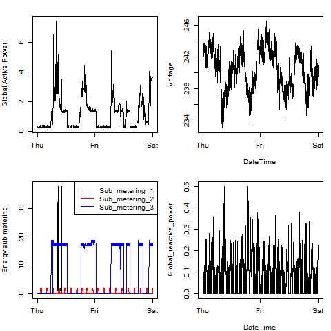

## Introduction

The objective of this assignment is to produce the graphs provided
as part of the requirements specified. 

##Key Assumption   
The code files provided use data in the file **"household_power_consumption.txt"**
that is in the **current working directory** where the rest of the scripts
are located. 

##Data Context  
The data is obtained from the <a href="http://archive.ics.uci.edu/ml/">
UC Irvine Machine Learning Repository</a>, a popular repository for machine learning
datasets. In particular, we will be using the "Individual household
electric power consumption Data Set" which I have made available on
the course web site:

* <b>Description</b>: Measurements of electric power consumption in
one household with a one-minute sampling rate over a period of almost
4 years. Different electrical quantities and some sub-metering values
are available.

##Data Description  

The following descriptions of the 9 variables in the dataset are taken
from
the <a href="https://archive.ics.uci.edu/ml/datasets/Individual+household+electric+power+consumption">UCI
web site</a>:

<ol>
<li><b>Date</b>: Date in format dd/mm/yyyy </li>
<li><b>Time</b>: time in format hh:mm:ss </li>
<li><b>Global_active_power</b>: household global minute-averaged active power (in kilowatt) </li>
<li><b>Global_reactive_power</b>: household global minute-averaged reactive power (in kilowatt) </li>
<li><b>Voltage</b>: minute-averaged voltage (in volt) </li>
<li><b>Global_intensity</b>: household global minute-averaged current intensity (in ampere) </li>
<li><b>Sub_metering_1</b>: energy sub-metering No. 1 (in watt-hour of active energy). It corresponds to the kitchen, containing mainly a dishwasher, an oven and a microwave (hot plates are not electric but gas powered). </li>
<li><b>Sub_metering_2</b>: energy sub-metering No. 2 (in watt-hour of active energy). It corresponds to the laundry room, containing a washing-machine, a tumble-drier, a refrigerator and a light. </li>
<li><b>Sub_metering_3</b>: energy sub-metering No. 3 (in watt-hour of active energy). It corresponds to an electric water-heater and an air-conditioner.</li>
</ol>

##Relevant data  

From the entire data set only data from the dates 2007-02-01 and
2007-02-01 is considered relevant

## Code Structure  

A set of four R files and the associated graphs produced from
these files are enclosed in the directory  

The four R files are:  

- run_Plot1.R which produces the output (plot1.png)
- run_Plot2.R which produces the output (plot2.png)
- run_Plot3.R which produces the output (plot3.png)
- run_Plot4.R which produces the output (plot4.png)

The four plots constructed are shown below. 

### Plot 1

 

### Plot 2

 

### Plot 3

 

### Plot 4

 

